Who am I
---

<!-- pause -->
##### **a passionate software engineer**
<!-- pause -->
##### *things I worked on*
<!-- pause -->
#### telecom switching stations
<!-- pause -->
#### JIT compilers
#### (Mono project, then V8 in Google)
<!-- pause -->
#### gaming engines (Unity 3D)
<!-- pause -->
##### interactive, collaborative VR
<!-- pause -->
#### 🦀 distributed systems and blockchains 🦀
<!-- pause -->
#### 🦀 operational research (vehicle routing) 🦀

---

That was me, Professionally
---

##### *Who am I, for this talk?*

##### 🤖 Robotic Competitions as a Hobby 🎉

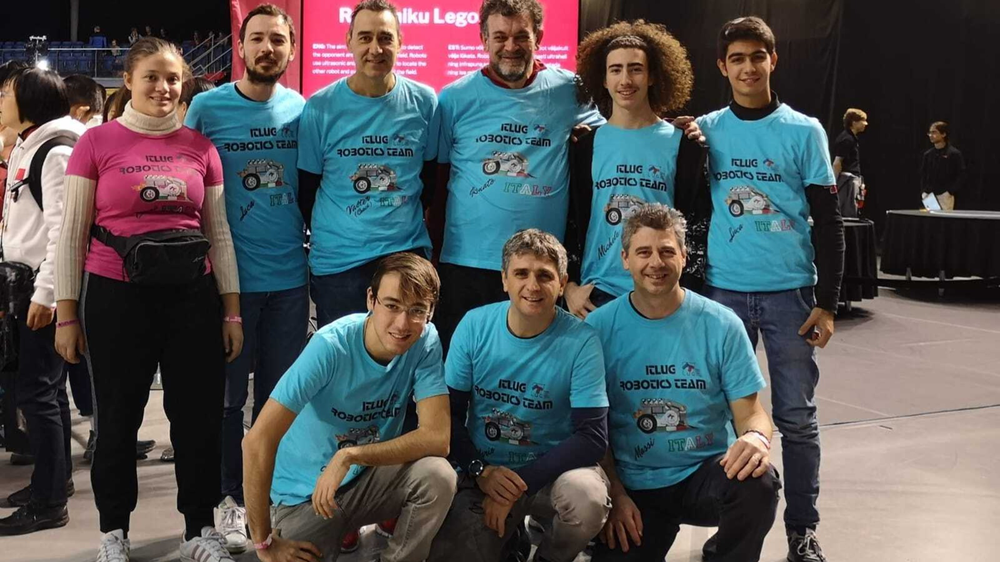

##### ItLUG Robotics Team

---

Talk Outline
---

#### 🤖          Line Follower Robots          🤖
#### 🤖             PID controller             🤖
#### 🦀      embedded Rust on a EV3 brick      🦀
#### 🦀       wrapping an embedded C SDK       🦀
#### 🤖           the need for async           🤖
#### 🦀         a custom async runtime         🦀
#### 🦀              embedded GUI              🦀
#### 🤖         the need for telemetry         🤖
#### 🦀    telemetry and data visualization    🦀
##### 🤖   advanced line following techniques   🤖

##### these are **two** *talks* in **one**!
##### let's go **full** *speed* and *hope* for the **best**

---

🤖 Line Follower Robots 🤖
---

##### there are...

#### 🏎️💨 fast ones 🏎️💨
#### 6㎧ on straight lines
##### 💥 engineering marvels 💥

#### 🤖 Lego ones 🤖
#### 🐌 much slower 🐌
#### 1㎧ overall speed
#### 🤔 different challenges 🤔

---

A Toy Line Follower
---

#### use only two sensors
##### ⬅ **left** and **right** ➡
#### if one **side** *senses* the **line**,
##### **turn** that *way*
##### *otherwise*, go **straight**

#### **LET'S SEE**

---

Can we do better?
---

##### this *robot* is **"binary"**
##### it does *not* have **proportional** reactions
##### *how* can we **improve** it?

---

Analog Sensors
---

#### use **analog** *sensors*
##### *a strange configuration*
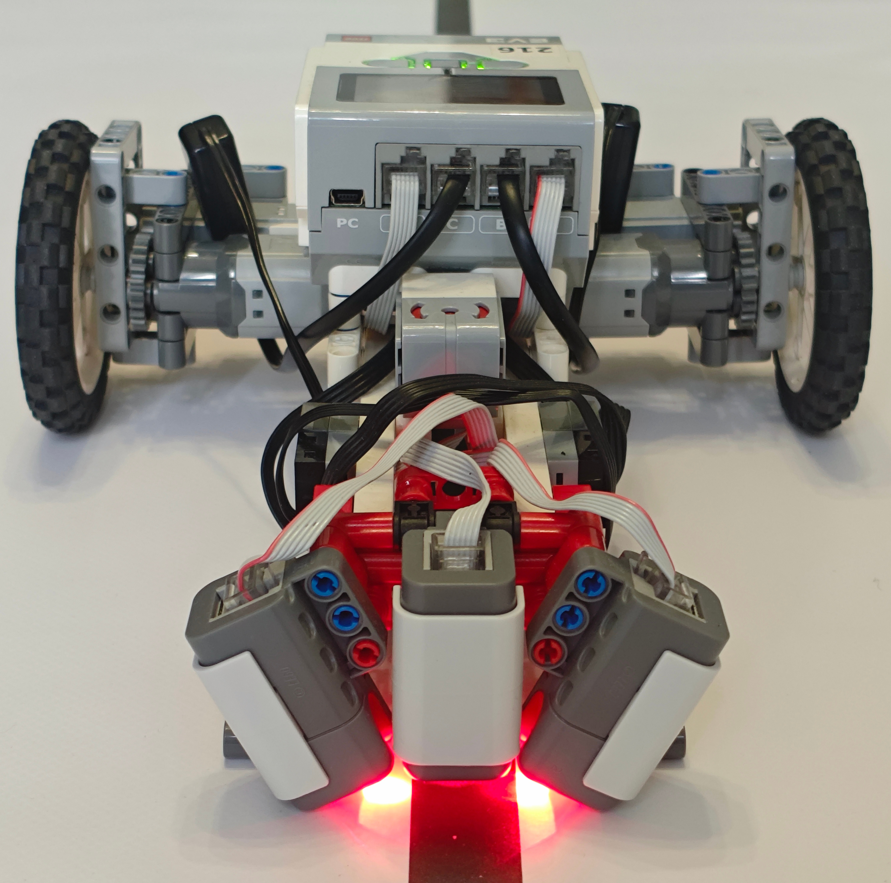
#### **sub millimeter** *accuracy*

---

Fixed Point Math
---

#### the EV3 CPU dos not have a
##### Floating Point Unit

##### fixed-point math to the rescue!

##### time: **`㎲`**

#### distance: **`㎜`**
##### *(error in **`㎛`**)*

#### speed: **`㎜/s`**
##### *(same as **`㎛/㎳`**)*

#### **wheel** *rotation speed*
##### in **`㎛/㎲`!**


---

🤖 Use a 🅿 🅸 🅳 Controller 🤖
---

##### What is it?

```
🅿 Proportional
🅸 Integral
🅳 Derivative
```

#### given the error ⓔ
#### *(the distance from the line)*
##### and three constants `k`: `ₖ🄿 ` `ₖ🄸 ` `ₖ🄳 `

##### `turn` = ⓔ ×`ₖ🄿 ` + (∫ⓔ dt)×`ₖ🄸 ` + (dⓔ /dt)×`ₖ🄳 `

##### *this gives **smooth** trajectory control*

---

🤖 Tuning a 🅿 🅸 🅳 Controller 🤖
---

<!-- column_layout: [1, 1] -->
<!-- column: 0 -->
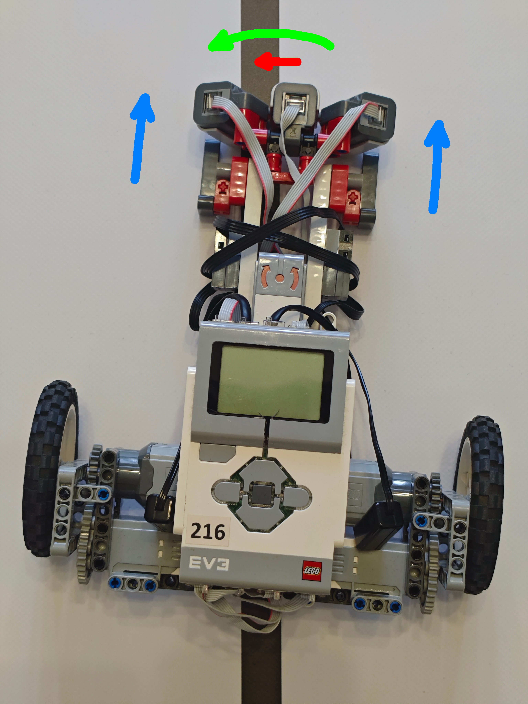
<!-- column: 1 -->
##### *proportional*

#### 🔵
##### robot speed

#### 🔴
##### distance from line

#### 🟢
##### desired turn

##### `turn` = ⓔ ×`ₖ🄿 `

---

🤖 Tuning a 🅿 🅸 🅳 Controller 🤖
---

<!-- column_layout: [1, 1] -->
<!-- column: 0 -->
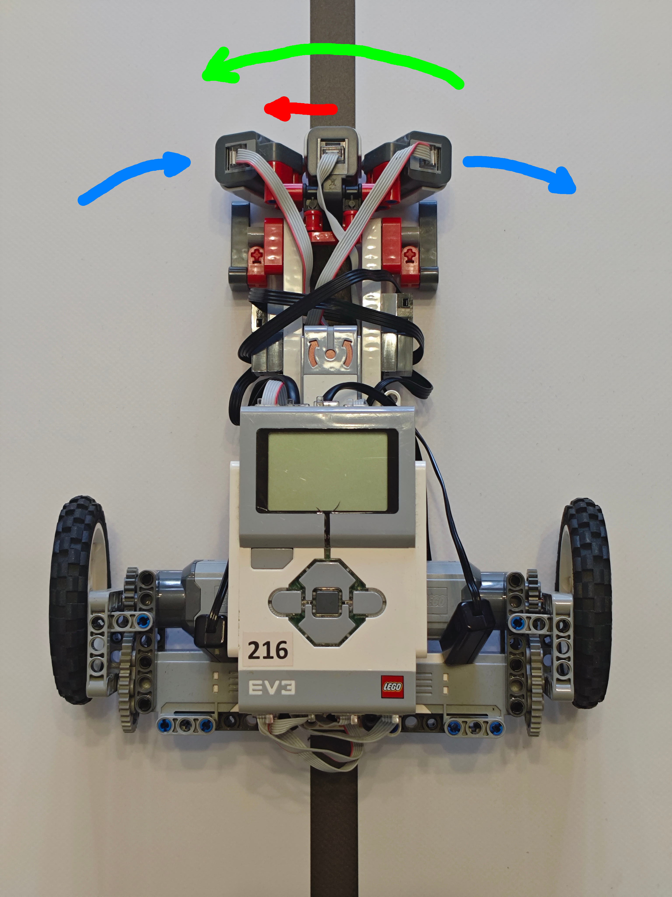
<!-- column: 1 -->
##### *derivative*

#### 🔵
##### robot rotation

#### 🔴
##### apparent line speed

#### 🟢
##### desired compensation

##### `turn` = (dⓔ /dt)×`ₖ🄳 `

---

🤖 Tuning a 🅿 🅸 🅳 Controller 🤖
---

<!-- column_layout: [1, 1] -->
<!-- column: 0 -->
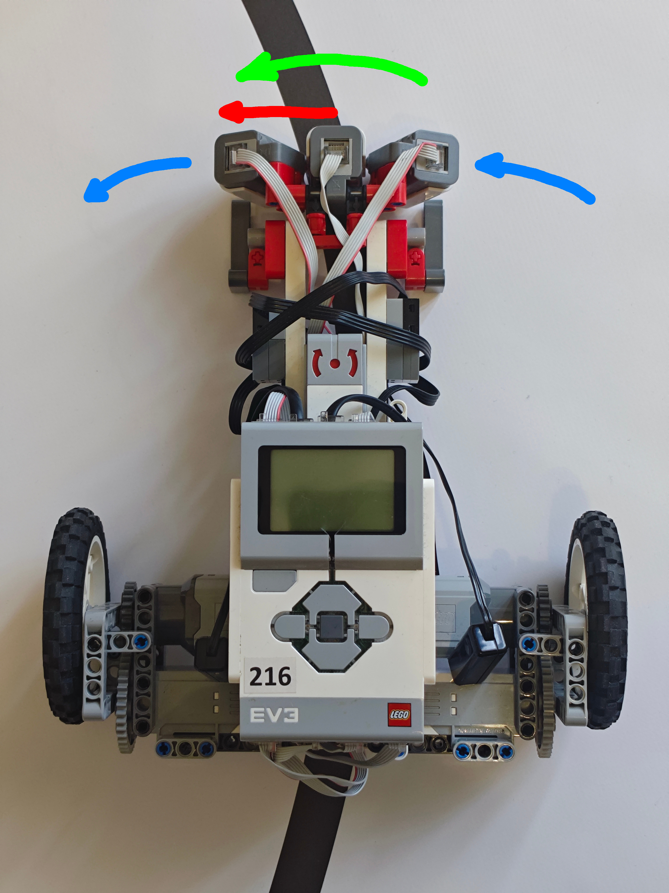
<!-- column: 1 -->
##### *integral*

#### 🔵
##### robot rotation

#### 🔴
##### line distance over time

#### 🟢
##### desired turn

##### `turn` = (∫ⓔ dt)×`ₖ🄸 `

---

🤖 Tuning a 🅿 🅸 🅳 Controller 🤖
---

<!-- column_layout: [1, 1, 1] -->
<!-- column: 0 -->
##### *proportional*
##### `turn` = ⓔ ×`ₖ🄿 `

#### *considers*
#### **now**
<!-- column: 1 -->
##### *derivative*
##### `turn` = (dⓔ /dt)×`ₖ🄳 `

#### *predicts*
#### the **future**
<!-- column: 2 -->
##### *integral*
##### `turn` = (∫ⓔ dt)×`ₖ🄸 `

#### takes the **past**
#### into *account*

---

BUT WAIT
---

##### 🦀 What About Rust? 🦀
##### 🤔 isn't this a Rust conference? 🤔

---

🦀 Why Rust... 🦀
---

##### ...in a hobby robotic project?
##### to *learn* the **language**
##### to *avoid* **mistakes**
##### *because* it is **possible!**

---

🦀 Rust on a EV3 🤖
---

#### original firmware
##### *(let's skip this)*

#### `ev3dev` (a Debian port)
##### *unpredictable latency (up to 20㎳)*

#### 🤔 *why* is latency an **issue** ❓

---

🤖 Hard Real Time 🤖
---

##### the **PID** runs in an *event loop*
##### a *late* result is a **wrong** result
##### 🤔 how *fast* is **fast enough?** 🤔
#### ⛔ *not* ⛔
##### as *fast* as **possible**
#### ✅ *but* ✅
##### as *fast* as **needed**

---

Line Follower Latency
---

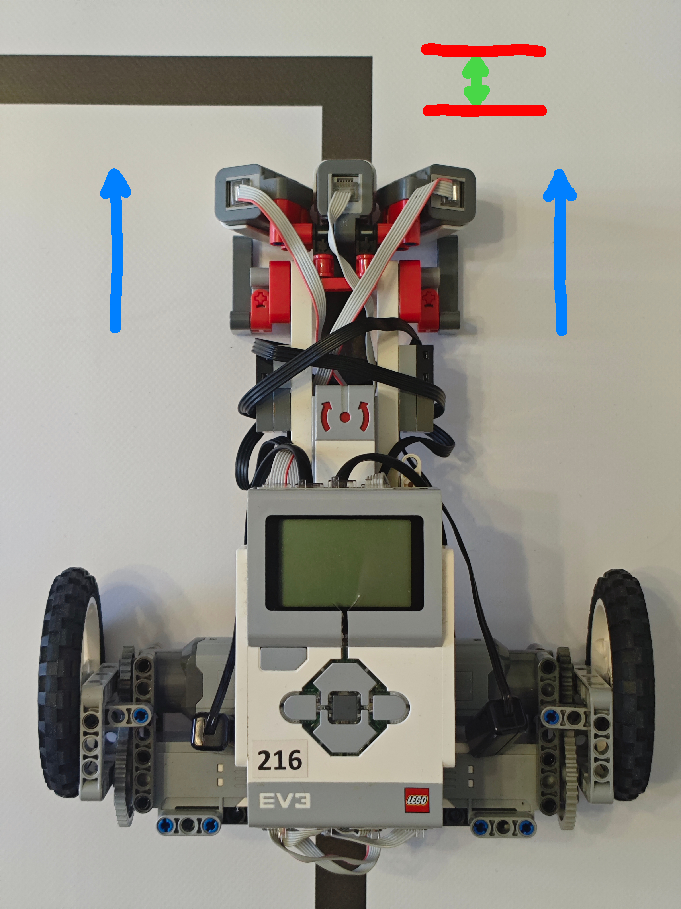

#### bot speed:
#### 1.0㎧: 2㎳ ➡ 2㎜
#### 1.5㎧: 2㎳ ➡ 3㎜
##### 2.0㎧: 2㎳ ➡ 4㎜

#### line *width*: **20㎜**
#### max *latency*: about **4㎳**

---

Enter EV3RT
---

#### a *port* of **TOPPERS HRP2**
##### *an industrial Real Time OS*
##### 💥 Open Source 💥
##### *docs* and *comments* in 🇯🇵 **Japanese** 😮

#### 😄 with a usable C SDK 👍

---

🦀 Rust on EV3RT 💻
---

##### *wrapping* the **C API** is easy
##### EV3RT has a *dynamic* program **loader**
##### *programs* are "custom" **ELF files**
##### the *linker* script is **crazy**

---

EV3RT 🤖 Rust 🦀 Linking 🔗 Recipe
---

#### compile a sample EV3RT C app
#### with a trivial `main()`
##### and keep all the `.o` files
#### compile Rust code to a static lib (`.a`)
##### that implements the `main()` function
#### replace the `main` C `.o` file
##### with the Rust `.a` library
#### use the EV3RT linker script
##### to produce the loadable app

##### **😄...PROFIT! 😄**

---

💻 EV3RT 🦀 Rust `API` 💻
---

#### *simple*, **imperative** low-level **API**
#### access *every* **EV3 port**
#### support *every* **sensor** and **motor**
##### get **time** (㎲) and **sleep** (㎳)

#### also provides *simplified* interfaces
##### to **file** system and **Bluetooth**

#### *usable*, but **not enough**

---

The Need for `async`
---

##### PARALLEL READS

##### sensors *read* rate **mismatches**
#### NXT analog:  **3㎳**
#### Ultrasound: **20㎳**
##### RGB color:  **1㎳**

#### a logic *loop* should read in **parallel**
#### *RGB* color data every **1ms**
##### *Ultrasound* updates every **20㎳**

#### *(not really in this robot)*

---

The Need for `async`
---

##### PARALLEL LOGIC

#### robot *logic* can be composed of
##### different **parallel** state machines

#### process **line error**
##### *(dⓔ /dt, ∫ⓔ dt, filtering)*

#### process **motor status**
##### *(compute speed)*

##### run **driving logic**

##### collect **telemetry**

##### handle **screen** and **input**

---

EV3RT API Mismatch
---

##### the *EV3RT API* is **synchronous**
##### it does **not** expose *interrupts*
#### **tasks** are *cumbersome* to use
##### *(no channels)*
##### it's *like* ⬜ **squaring** a ⚪ **circle**

##### but *remember*: **1㎳** latency is **fine**

---

💡 Idea: a Dumb `async` Runtime 💡
---

#### run a **1㎳** event **loop** collecting
##### all **data** with *pending reads*

##### use `Future` with **no** *waker*

##### implement `poll` checking for **new** *data*

#### in **each** event loop *iteration*
##### **poll** the *root* `Future`

---

🦀 `async` Event Loop 🦀
---

```rust
pub fn run(self, future: mut PinBoxed<impl Future<Output = ()>>) {
    let waker = noop_waker();
    let mut context = core::task::Context::from_waker(&waker);

    loop {
        self.ev3.update();
        if future.as_mut().poll(&mut context) == core::task::Poll::Ready(()) {
            break;
        }
        self.ev3.apply();
        ev3rt::msleep(1);
    }
    ev3rt::reset(false);
}
```

---

🦀 `async` Boilerplate 🦀
---

```rust
fn no_op(_: *const ()) {}
fn no_op_clone(_: *const ()) -> core::task::RawWaker {
    noop_raw_waker()
}
static RWVT: core::task::RawWakerVTable =
    core::task::RawWakerVTable::new(no_op_clone, no_op, no_op, no_op);

#[inline]
fn noop_raw_waker() -> core::task::RawWaker {
    core::task::RawWaker::new(core::ptr::null(), &RWVT)
}

#[inline]
fn noop_waker() -> core::task::Waker {
    unsafe { core::task::Waker::from_raw(noop_raw_waker()) }
}
```

---

🦀 A `main` function, `async` style 🦀
---

```rust
async fn main<EV3: Ev3Brick>(ev3: EV3) {
    ev3.init();
    ev3.setup().await;

    let error = ErrorTask::new();
    let motors = MotorsTask::new();
    let telemetry = TelemetryTask::new();

    zip!(
        error.run(&ev3),
        screens(&ev3, &error, &motors, &telemetry),
        motors.run(&ev3),
        telemetry.run(&ev3, &error, &motors)
    )
    .await;
}
```

---

🦀 The full `main_task` function 🦀
---

```rust
static FONT: Font<LcdTopSideUp> = build_font::<LcdTopSideUp>();
#[no_mangle]
pub extern "C" fn main_task() {
    let ev3 = Ev3::new(&FONT, Duration::from_ms(25));
    let future = main(ev3.clone());
    ev3.run(pin_boxed(future), false);
}
```

##### *pinning boilerplate*

```rust
pub type PinBoxed<T> = core::pin::Pin<alloc::boxed::Box<T>>;
pub fn pin_boxed<T>(t: T) -> PinBoxed<T> {
    alloc::boxed::Box::pin(t)
}
```

---

🦀 Inner Event Loop Details 🦀
---

```rust
loop {
    self.ev3.update();
    if future.as_mut().poll(&mut context) == core::task::Poll::Ready(()) {
        break;
    }
    self.ev3.apply();
    ev3rt::msleep(1);
}
```

#### `ev3` has the **full** *hardware* **state** but it is **not** `mut`
##### *its reference is shared with all tasks*

#### *every* piece of **data** is *enclosed* in a `Cell`
##### **OK**, because the *executor* is **single-threaded**

##### *every* `Future` **refers** to a `Cell`:
#### it can *provide* the **current** value immediately
#### it supports `.await` for the **next value**
#### it can provide a `Stream` of **future values**


---

🦀 A Fast UI 🦀
---

##### Having a **UI** for the robot is **useful!**

##### Let's *see* what it **means**

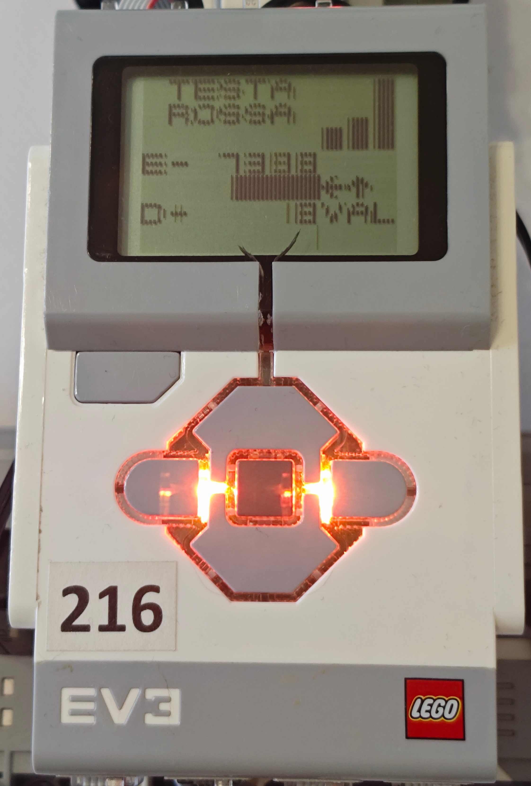

---

The Fast UI Challenge
---

##### the **EV3** *screen*

##### resolution is **small** *(178×128)*

#### framebuffer memory *layout* is **crazy**
#### monochrome, **2 bits** per *pixel*, **3 pixels** per *byte*
##### not so big (total size **7680 bytes**), but...

##### ...a **full** screen *render* is insanely **slow**

##### *and latency is bad, right?*

---

Graphical Requirements
---

##### writing text, numbers and symbols

##### statically pick a screen orientation

##### very easy to read "in action"

##### drowing real time bar charts

---

Idea: a Character Based UI
---

#### a **18×18** square *font*
#### is **big** and **readable**
#### can be *easily* **rotated**
##### does *not* **cross** *bytes*

##### the *screen* fits **10×7 chars**
##### three square regions
##### (1 main **7×7**, 2 secondary **3×3**)
##### *again, easy to rotate*

---

Fast Screen Refresh
---

#### a **full** frame *buffer* now is **10×7** = **70** bytes
##### **double** *buffering* becomes **feasible**
#### a *diff* between two screens is almost **instant**
##### we can *redrow* only **changed** characters
##### drowing each *character* is a **54 bytes** write
##### *redrows* are limited to a **fixed framerate**
##### *(refreshing every 25㎳ is fine)*

---

Understanding What Goes Wrong
---

#### having a **UI** is *fine*
##### but we **cannot** use it while the *robot* **races**

#### **filming** the *robot* while it runs is **fine**
##### but it does **not** show what *happens* **inside**

#### we **need** a *telemetry* **system**

---

What Do We Need?
---

##### we would like to inspect

#### timestamps `㎲`
#### line error `ⓔ`
#### error derivative `dⓔ /dt`
#### gyro `deg/s`
#### left and right wheel speed `㎜/s`
#### left and right motor power `PWM`
#### left, center, right sensor `flags`
#### out condition `direction`
##### overall distance `㎜`

#### *fits in 20 bytes*


---

The Telemetry Challenge
---

##### we want to *see* **every** decision **taken**
##### potentially at a **10㎑** rate
##### transmitting **200 KB/s** over **BT**
##### *while* the robot *runs*
##### ⛔ **NO WAY** ⛔

---

Offline Telemetry
---

#### in *practice* the event loop *runs* at **0.5㎑**
##### **10k** samples take **200 KB** of **RAM**
#### at **0.5㎑** they cover **20s**
##### *this is more than enough!*

##### *(reducing sample rate covers more time)*

##### just **save** the *data file* when the race **stops**

---

Telemetry Task
---

##### **receives** data samples from *other tasks*
##### **pushes** samples to the *ring buffer*
##### at the *required* **rate**
##### **saves** data when *requested*
##### *(just as the race stops)*

---

Telemetry Result
---

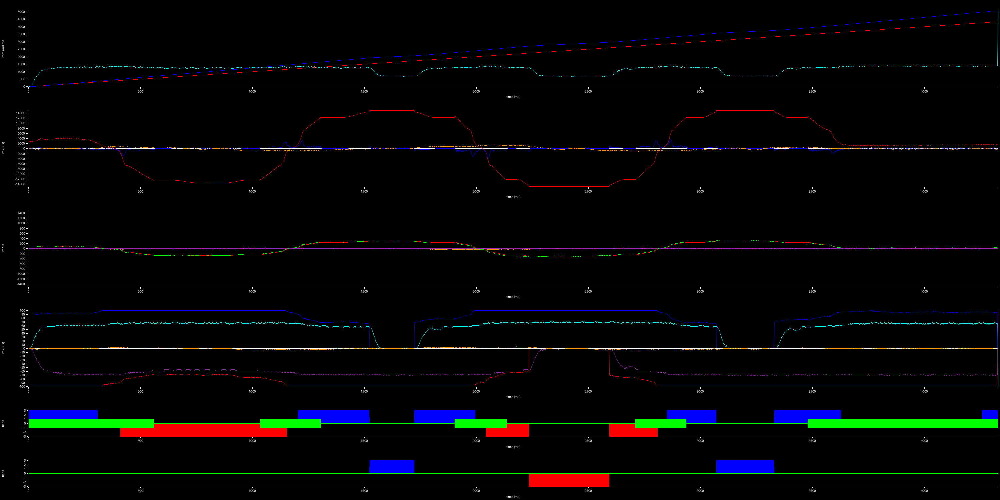

---

🤖 A Better Line Follower 🤖
---

##### CONSTRUCTION

<!-- column_layout: [1, 1] -->
<!-- column: 0 -->
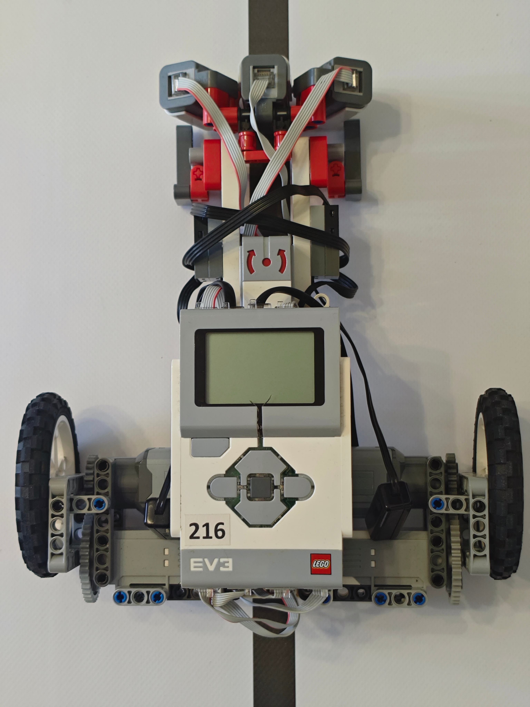
<!-- column: 1 -->


---

🤖 A Better Control Algorithm 🤖
---

##### tuning 🅿 🅸 🅳 parameters

##### can be *very* **confusing**

#### their *intuitive* meaning
##### is **not** *difficult*

#### but their **actual** *values*
##### can be **elusive**

##### 🤔 *is there a better way?* 🤔

---

🤖 Tuning Error Compensation 🤖
---

<!-- column_layout: [1, 1] -->
<!-- column: 0 -->
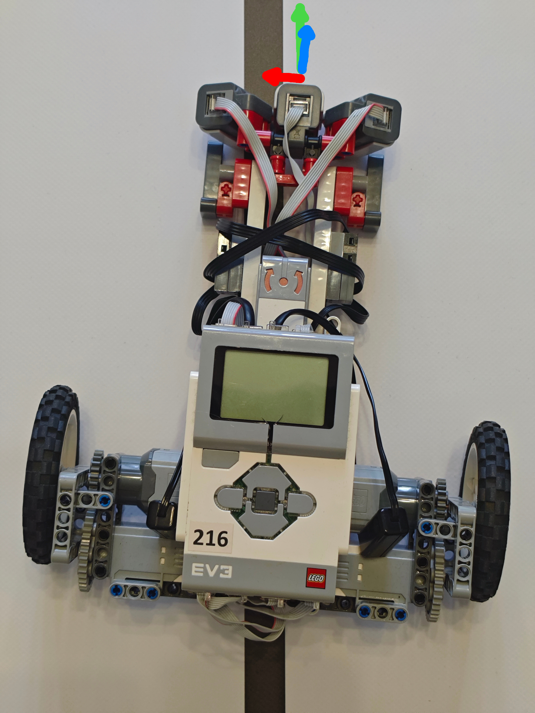
<!-- column: 1 -->

#### 🔴
##### distance from line

#### 🔵
##### robot direction

#### 🟢
##### desired direction

#### the **desired** *direction* is
##### **parallel** to the *line*


---

🤖 Tuning for Zero Rotation 🤖
---

<!-- column_layout: [1, 1] -->
<!-- column: 0 -->
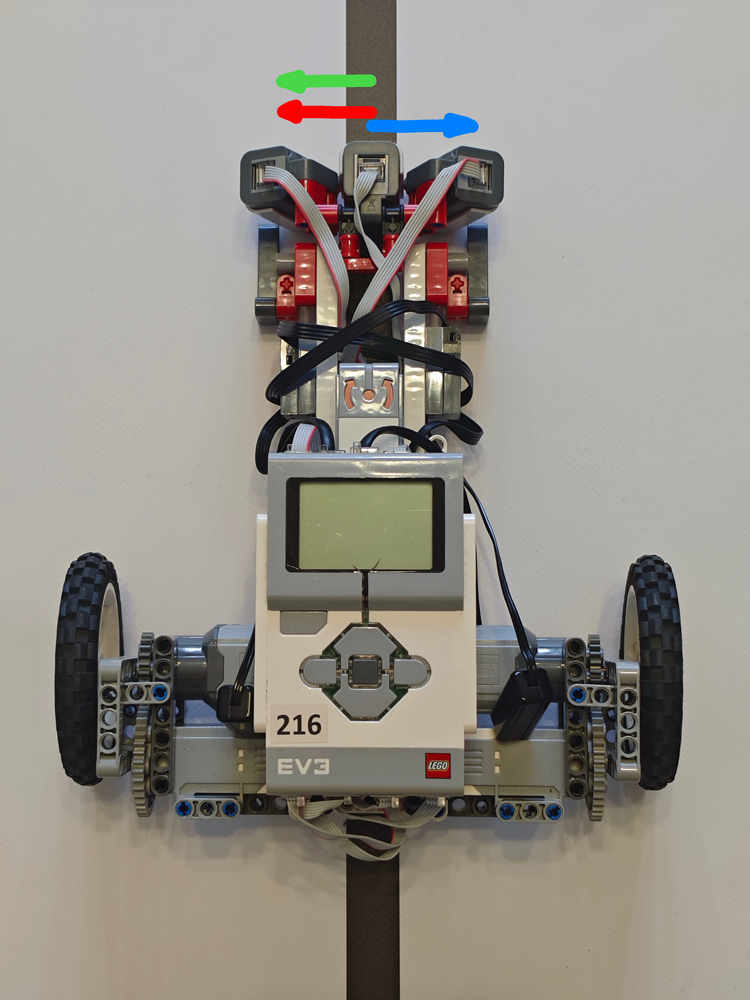
<!-- column: 1 -->

#### 🔵
##### robot rotation speed

#### 🔴
##### apparent line speed

#### 🟢
##### desired compensation

#### the **desired** *rotation*
#### *speed* is **zero**
#### *(a **gyro** can be useful!)*

---

🤖 Tuning for Smooth Turns 🤖
---

<!-- column_layout: [1, 1] -->
<!-- column: 0 -->
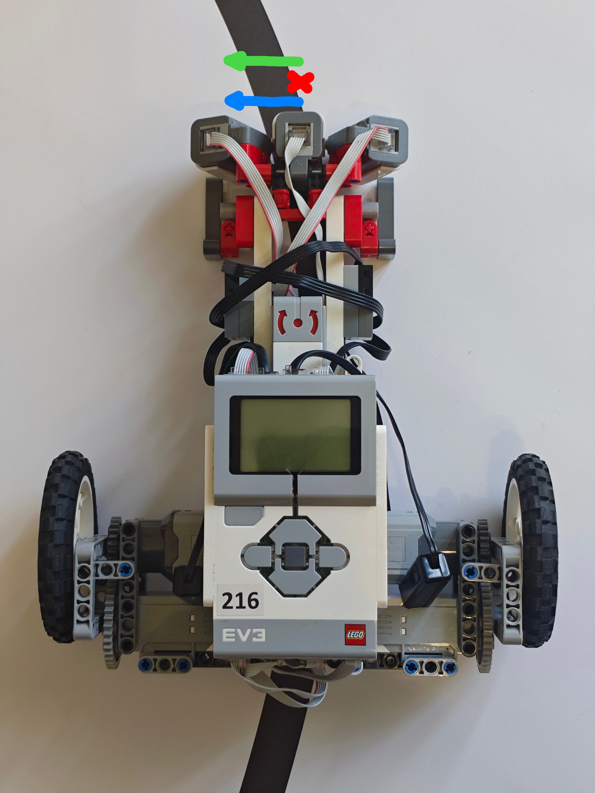
<!-- column: 1 -->

##### consider *rotation speeds:*

#### 🔵
#### **actual** rotation speed **`RS`**
##### *taken from gyro or from wheels speeds*

#### 🔴
#### **apparent** rotation speed **`LS`**
##### *from line side speed (dⓔ /dt)*

#### 🟢
#### the **desired** rotation *speed* is
##### **`RS` - `LS`**


---

DEMO TIME
---


```
 _    ____  ___. ____
 |    |___  |  ' [__
 |___ |___  |    ___]

 _  _ ____ _  _ ____    ____ _  _ _  _   /
 |__| |__| |  | |___    |___ |  | |\ |  / 
 |  | |  |  \/  |___    |    |__| | \| .

```

---

Finally...
---

```

 ████████╗██╗  ██╗ █████╗ ███╗   ██╗██╗  ██╗███████╗██╗
 ╚══██╔══╝██║  ██║██╔══██╗████╗  ██║██║ ██╔╝██╔════╝██║
    ██║   ███████║███████║██╔██╗ ██║█████╔╝ ███████╗██║
    ██║   ██╔══██║██╔══██║██║╚██╗██║██╔═██╗ ╚════██║╚═╝
    ██║   ██║  ██║██║  ██║██║ ╚████║██║  ██╗███████║██╗
    ╚═╝   ╚═╝  ╚═╝╚═╝  ╚═╝╚═╝  ╚═══╝╚═╝  ╚═╝╚══════╝╚═╝

```


#### `https://github.com/massimiliano-mantione/talks/EuroRust2025`