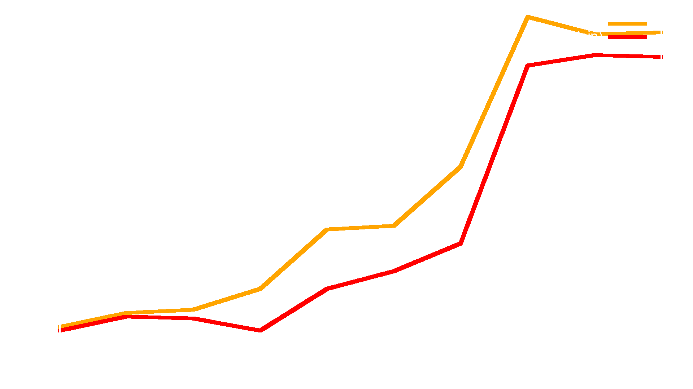

Image Test
---



-------

Code Test
---

```rust
compose!(
  &validation_service,
  &place_order_service
)(order_service(key))
```

-------


Who am I
---

<!-- pause -->
##### **a passionate software engineer**
<!-- pause -->
##### *things I worked on*
<!-- pause -->
#### telecom switching stations
<!-- pause -->
#### JIT compilers
#### (Mono project, then V8 in Google)
<!-- pause -->
#### gaming engines (Unity 3D)
<!-- pause -->
#### interactive, collaborative VR
<!-- pause -->
##### 🦀 distributed systems and blockchains 🦀
<!-- pause -->
#### 🦀 operational research (vehicle routing) 🦀

-------

Recap
---

<!-- pause -->
##### 🦀 Rust is amazing 🎇
<!-- pause -->
##### 🛠  there are projects where it shines 🌞
<!-- pause -->
#### 🤝 you build trust 🤝
##### 🔮 by being reliable 🔮
<!-- pause -->
##### 😃 a healthy workplace is important 😃
<!-- pause -->
#### 🙏 **thanks!** 🙏
<!-- pause -->
##### ❓ *questions?*  ❓
