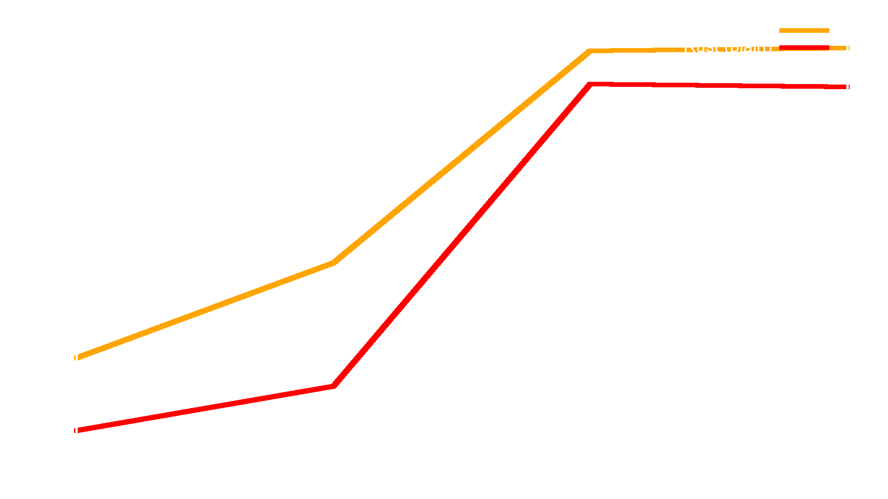
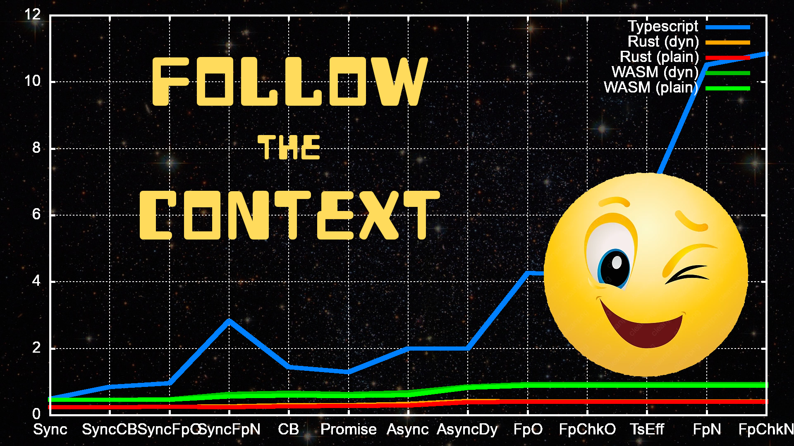

Who am I
---

<!-- pause -->
##### **a passionate software engineer**
<!-- pause -->
##### *things I worked on*
<!-- pause -->
#### telecom switching stations
<!-- pause -->
#### JIT compilers
#### (Mono project, then V8 in Google)
<!-- pause -->
#### gaming engines (Unity 3D)
<!-- pause -->
#### interactive, collaborative VR
<!-- pause -->
##### 🦀 distributed systems and blockchains 🦀
<!-- pause -->
#### 🦀 operational research (vehicle routing) 🦀

-------

This Talk...
---

<!-- pause -->
#### ...actually already happened!
<!-- pause -->
#### *TsConf 2019*
##### *Desenzano*
<!-- pause -->
##### I did it with **Gianluca Carucci**
<!-- pause -->
#### *(but it was not recorded)*

-------

What Actually happened
---

<!-- pause -->
##### Gianluca:
<!-- pause -->
> Aren't these abstractions amazing?

<!-- pause -->
##### Massi:
<!-- pause -->
> Ok, but how much do they cost?

<!-- pause -->
#### *...and then we started talking...*

-------

Abstractions, the Simplistic Way
---

<!-- pause -->
#### using abstractions, we make software
##### 💡 **easier** to **understand** 💡

<!-- pause -->
##### 🪳 software has **less bugs** 🪳

<!-- pause -->
##### 🔧 software is **more maintainable** 🔧

<!-- pause -->
##### 🎇 let's use **more abstractions**... 🎇

<!-- pause -->
##### 💲 *profit!* 💲

-------

TL;DR
---

<!-- pause -->
##### It's
<!-- pause -->
##### **Not**
<!-- pause -->
##### *That*
<!-- pause -->
##### **Simple!**

-------

An Example: **Library Order Workflow**
---

<!-- pause -->
#### get an order of books
##### *(a list of books and quantities)*

<!-- pause -->
#### validate it
##### *(using an external service)*

<!-- pause -->
#### place the order
##### *(compute its price first)*


-------

Game Rules
---

<!-- pause -->
##### each operation is `async`

<!-- pause -->
##### *each* operation can **fail**

<!-- pause -->
#### the workflow *result* is
##### the order **total cost**

-------

Plain `async` TypeScript
---

```typescript
  const order = await orderService(orderKey)
  if (order == null) {
    return { success: false }
  }

  const validationResult = await validationService(order)
  if (!validationResult.valid) {
    return { success: false }
  }

  return await placeOrderService(order)
```

-------

Abstraction: **Monadic Composition**
---

<!-- pause -->
##### *did you notice those error handling blocks?*

```typescript
  if (/* something wrong */) {
    return { success: false }
  }
```

<!-- pause -->
#### they are **repetitive** and get in the way
##### they are like **noise** hiding the main flow

<!-- pause -->
#### could we just **compose** the *main blocks* and
##### let the *composition* handle the **effects**?

-------

Functional TypeScript (Effects)
---

```typescript
  return Effect.runAync(
    pipe(
      orderKey,
      orderService,
      Effect.andThen(validationService),
      Effect.andThen(placeOrderService),
      Effect.catchAll(e => Effect.succeed({ success: false }))
    )
  )
```

##### *this uses the **Effects** library*

-------

Functional TypeScript (Effects)
---

```typescript {1,2,8,9}
  return Effect.runAync(
    pipe(
      orderKey,
      orderService,
      Effect.andThen(validationService),
      Effect.andThen(placeOrderService),
      Effect.catchAll(e => Effect.succeed({ success: false }))
    )
  )
```

##### *we first build and async pipe*

-------

Functional TypeScript (Effects)
---

```typescript {3}
  return Effect.runAync(
    pipe(
      orderKey,
      orderService,
      Effect.andThen(validationService),
      Effect.andThen(placeOrderService),
      Effect.catchAll(e => Effect.succeed({ success: false }))
    )
  )
```

##### *pass the **order key** as 1st argument*

-------

Functional TypeScript (Effects)
---

```typescript {4-6}
  return Effect.runAync(
    pipe(
      orderKey,
      orderService,
      Effect.andThen(validationService),
      Effect.andThen(placeOrderService),
      Effect.catchAll(e => Effect.succeed({ success: false }))
    )
  )
```

##### *and then run the workflow*

-------

Functional TypeScript (FP-TS)
---

```typescript {2-4}
  return pipe(
    orderService(key),
    chain(validationService),
    chain(placeOrderService)
  )()
    .then(evaluateEither)
    .catch(() => { success: false })
```

#### *an alternative implementation*
##### *using the **FP-TS** library*

-------

Abstraction: **Typestate Pattern**
---

<!-- pause -->
##### 🤔 consider this error handling logic: 🤔

```typescript
  const validationResult = await validationService(order)
  if (!validationResult.valid) {
    return { success: false }
  }
  return await placeOrderService(order)
```

<!-- pause -->
##### ❓ isn't this brittle? ❓

-------

Abstraction: **Typestate Pattern**
---

##### 🤔 what if we didn't validate the order: 🤔

```typescript
  const validationResult = await validationService(order)
  // if (!validationResult.valid) {
  //   return { success: false }
  // }
  return await placeOrderService(order)
```

<!-- pause -->
##### ❓ when would the error be caught? ❓

-------

Abstraction: **Typestate Pattern**
---

##### if *validation* generated a **validated order**...

```typescript
  const order = await validationService(order)
  if (!order.valid) {
    return { success: false }
  }
  return await placeOrderService(order)
```

<!-- pause -->
##### ...and `placeOrderService` *required* it...

-------

Abstraction: **Typestate Pattern**
---

##### ...then *this* code...

```typescript
  const order = await validationService(order)
  // if (!order.valid) {
  //   return { success: false }
  // }
  return await placeOrderService(order)
```

<!-- pause -->
##### 😃 **...would not even compile!** 😃

-------

Checked TypeScript
---

```typescript {2-4}
  return pipe(
    orderService(key),
    chain(validationService),
    chain(placeOrderService)
  )()
    .then(evaluateEither)
    .catch(() => { success: false })
```

<!-- pause -->
##### `validationService` returns a different type
<!-- pause -->
##### `placeOrderService` only accepts that type

-------

Checked TypeScript
---

```typescript {2-4}
  return pipe(
    orderService(key),
    // chain(validationService),
    chain(placeOrderService)
  )()
    .then(evaluateEither)
    .catch(() => { success: false })
```

##### This does not compile!

-------

So Far, So Good
---

<!-- pause -->
##### do *abstractions* look **nice**?

<!-- pause -->
##### do they **improve** the code?

<!-- pause -->
##### do they **cost** us *anything*?

<!-- pause -->
#### *what* does it **mean**, and
##### *how* do we **know**?

<!-- pause -->
##### *let's **define** a few terms*

-------

Definitions
---

> 💡 **Abstraction:**
> A **single** *high level* construct that can replace **many** *low level* ones

<!-- pause -->
##### An uncontroversial example:
#### structured programming
#### (no `goto`s)

-------

Definitions
---

> 🔧 **Maintainability:**
> How **easy** it is to *change* a piece of software **without** introducing *bugs*

<!-- pause -->
##### *correlated* to **clarity**
<!-- pause -->
##### *negated* by **complexity**

-------

Definitions
---

<!-- pause -->
> 🧠 **Cognitive:**
> related to something you know, from the Latin *cognosco* (I know), in turn from the Greek *gnόsis* (*γνώσις*, knowledge)

<!-- pause -->
> 🏋  **Overhead:**
> and extra quantity, usually undesired

<!-- pause -->
#### a *cognitive overhead* is
#### something you **must** keep in your mind
#### which you would rather
#### **avoid** having to think about

-------

Software Performance
---

> 💪 **Performance:**
> *efficiency* in using **resources** to obtain a given **result**

<!-- pause -->
##### software has a **better** performance if it:
<!-- pause -->
#### uses **less** *CPU time*
<!-- pause -->
#### uses **less** *memory*

-------

Cost
---

> 💲**Cost:**
> something you must *lose* to obtain a given *result*

<!-- pause -->
##### usually **money**
<!-- pause -->
##### but also **time**
<!-- pause -->
##### *(which, as we know, is money)*

-------

Definitions
---

```

 💡 Abstraction
 🔧 Maintainability
 🧠 Cognitive Overhead
 💪 Performance
 💲 Cost

```

-------

Abstractions Effects
---

```
 ┏━━━━━━━━━━━━━━━━━━━━━━━━━━━━━┓
 ┃      Domain        ┃ Result ┃
 ┃━━━━━━━━━━━━━━━━━━━━┃━━━━━━━━┃
 ┃                    ┃        ┃
 ┃                    ┃        ┃
 ┃                    ┃        ┃
 ┃                    ┃        ┃
 ┗━━━━━━━━━━━━━━━━━━━━━━━━━━━━━┛
```

-------

Abstractions Effects
---

```
 ┏━━━━━━━━━━━━━━━━━━━━━━━━━━━━━┓
 ┃      Domain        ┃ Result ┃
 ┃━━━━━━━━━━━━━━━━━━━━┃━━━━━━━━┃
 ┃ Maintainability    ┃ 😀 ➕➕┃
 ┃                    ┃        ┃
 ┃                    ┃        ┃
 ┃                    ┃        ┃
 ┗━━━━━━━━━━━━━━━━━━━━━━━━━━━━━┛
```

-------

Abstractions Effects
---

```
 ┏━━━━━━━━━━━━━━━━━━━━━━━━━━━━━┓
 ┃      Domain        ┃ Result ┃
 ┃━━━━━━━━━━━━━━━━━━━━┃━━━━━━━━┃
 ┃ Maintainability    ┃ 😀 ➕➕┃
 ┃ Cognitive Overhead ┃ 😐 ➖  ┃
 ┃                    ┃        ┃
 ┃                    ┃        ┃
 ┗━━━━━━━━━━━━━━━━━━━━━━━━━━━━━┛
```

-------

Abstractions Effects
---

```
 ┏━━━━━━━━━━━━━━━━━━━━━━━━━━━━━┓
 ┃      Domain        ┃ Result ┃
 ┃━━━━━━━━━━━━━━━━━━━━┃━━━━━━━━┃
 ┃ Maintainability    ┃ 😀 ➕➕┃
 ┃ Cognitive Overhead ┃ 😐 ➖➕┃
 ┃ Performance        ┃ 🤔     ┃
 ┃                    ┃        ┃
 ┗━━━━━━━━━━━━━━━━━━━━━━━━━━━━━┛
```

-------

Abstractions Effects
---

```
 ┏━━━━━━━━━━━━━━━━━━━━━━━━━━━━━┓
 ┃      Domain        ┃ Result ┃
 ┃━━━━━━━━━━━━━━━━━━━━┃━━━━━━━━┃
 ┃ Maintainability    ┃ 😀 ➕➕┃
 ┃ Cognitive Overhead ┃ 😐 ➖➕┃
 ┃ Performance        ┃ 🤔     ┃
 ┃ Overall Cost       ┃ ❓❓❓ ┃
 ┗━━━━━━━━━━━━━━━━━━━━━━━━━━━━━┛
```

<!-- pause -->
##### 🧠 cognitive overhead is tricky... 🤔

<!-- pause -->
##### ⏰ but we can measure performance! 💪

-------

Measuring Performance
---

<!-- pause -->
#### we can **benchmark**
##### the *implementations*

<!-- pause -->
##### record all execution times *(μs)*

<!-- pause -->
##### and **plot** them!

-------

Benchmark Rules
---

<!-- pause -->
#### process 100k orders
##### *(with a 20k warmup)*

<!-- pause -->
#### inject a %5 failure rate
##### *(to test error handling code)*

<!-- pause -->
##### take the mean execution time *(μs)*

<!-- pause -->
##### *(executed with deno 2.2.3)*

-------

Tested Implementations
---

<!-- pause -->
##### plain **async**
<!-- pause -->
##### **Effects** *(functional framework)*
<!-- pause -->
#### **FP-TS** *(2019)*
##### **FP-TS** *(2025)*
<!-- pause -->
#### **FP-TS** with typestate *(2019)*
##### **FP-TS** with typestate *(2025)*

-------

Typescript Abstractions
---


##### *is it any fast?*

-------

`async` to `Effects` library
---


##### about **3x** *slowdown*

-------

`async` to `FP-TS` library (2019 version)
---


##### about **2x** *slowdown*

-------

`async` to `FP-TS` library (2025 version)
---


##### 😮 about **5x** *slowdown* 😮

-------

The Typestate Pattern
---


##### has no impact on performance

-------

Benchmark Summmary
---

<!-- pause -->
##### *abstractions* **do** have a **cost**

<!-- pause -->
##### *does it matter?*

<!-- pause -->
##### in a *front end*, likely **no**

<!-- pause -->
##### in a *back end*, likely **yes**

<!-- pause -->
##### *could they have* **zero cost** *?*

-------

Zero-Cost Abstractions
---

<!-- pause -->
#### there are languages that claim this
##### *(mostly C++, Rust, likely Zig...)*

<!-- pause -->
#### but **what**
##### does it **mean**?

-------

Zero-Cost Abstractions
---

##### C++ Definition:

> C++ implementations obey the zero-overhead principle:
> What you don't use, you don't pay for. And further:
> What you do use, you couldn't hand code any better.
> 🖋    *Stroustrup, 1994*

<!-- pause -->
##### meaning:

<!-- pause -->
#### the abstractions are just as performant
#### as if you had written the underlying code
#### by hand

-------

An Example: `filter map`
---

<!-- pause -->
#### *Javascript*

```javascript
const evenSquaredNumbers = numbers
    .filter((num) => num % 2 === 0);
    .map((num) => num * num);
```

<!-- pause -->
#### *Rust*

```rust
let even_squared_sumbers = numbers.into_iter()
    .filter(|&num| num % 2 == 0)
    .map(|num| num * num)
    .collect::<Vec<_>>();
```
-------

Does It Matter?
---

<!-- pause -->
##### as **usual**, *it depends*

<!-- pause -->
##### suppose this is server-side code

<!-- pause -->
##### 🤔 *would you want to choose between* 🤔
<!-- pause -->
#### 😃 maintainable code 😃
<!-- pause -->
#### 🤑 doubling your cloud bills 🤑

-------

Let's Check If This Is True!
---

<!-- pause -->
##### let's *verify* the **zero-cost** claim!

<!-- pause -->
##### 🦀 **Rust benchmark** 🦀

<!-- pause -->
#### line by line *adaptation*
##### of the **Typescript** code

<!-- pause -->
##### same rules as before

<!-- pause -->
##### *(built with Rust 1.85.1)*

-------

Idiomatic `async` Rust
---

```rust
let order = order_service(key).await;
let validated = validation_service(order).await?;
let amount = place_order_service(validated).await?.amount;
```

-------

Rust with explicit `Future` code
---

```rust
order_service(key).await
    .ok_or_else(|| Err(OrderNotValid::BookNotExists))
    .and_then(validation_service).await
    .and_then(place_order_service).await
    .and_then(|result| result.amount)
```

-------

Rust with functional composition
---

```rust
let workflow = compose!(
    &validation_service, 
    &place_order_service,
    &order_service);
workflow(order_key).await
```

<!-- pause -->
##### *(the code with **typestate pattern** is identical)*

-------

Rust Benchmark Result
---



##### about **1.4x** *slowdown*

-------

Typescript *vs* Rust
---


##### 😮 from **7x** to **27x** *slower* 😮

-------

Typescript *vs* Rust
---

<!-- pause -->
#### why is Typescript
##### 🤔 so much slower? 🤔

<!-- pause -->
#### can we investigate
##### ❓ the cause? ❓

<!-- pause -->
##### 💡 yes, we can! 💡

-------

Typescript Benchmarks
---

#### plain **synchronous** code
#### *synchronous* code using **callbacks**
#### *synchronous* code using **FP-TS** *(2019)*
##### *synchronous* code using **FP-TS** *(2025)*

#### *asynchronous* code using **callbacks**
##### plain **async** code

#### **Effects** *(functional framework)*
#### **FP-TS** *(2019)*
##### **FP-TS** *(2025)*
#### **FP-TS** with typestate *(2019)*
##### **FP-TS** with typestate *(2025)*


-------

Typescript Benchmarks
---


-------

Typescript Benchmarks
---


-------

Typescript Benchmarks
---


-------

Typescript Benchmarks
---


-------

Rust Benchmarks
---

#### plain **synchronous** code
#### *synchronous* with **functional composition**
#### *synchronous* with **functional composition** and **typestate**
##### *synchronous* with **functional pipeline**

#### *async* **imperative** code
#### *async* **idiomatic** code
##### *async* code using **`Future` API**

#### *async* code using **`Future` Objects**
#### *asynchronous* with **functional composition**
##### *asynchronous* with **functional composition** and **typestate**


-------

Rust Benchmarks
---


-------

Typescript *vs* Rust
---


-------

Was This Fair?
---

<!-- pause -->
#### after all, *Rust* compiles
##### to **native** code

<!-- pause -->
##### it *cannot* run in a **browser**

<!-- pause -->
##### **or can it?**

-------

Enter **`WASM`**
---

<!-- pause -->
##### Rust *can* compile to **WASM**

<!-- pause -->
##### it is like *adding* an **abstraction**

<!-- pause -->
#### from **native** code
<!-- pause -->
##### to *code* that can *run* on **any CPU**

<!-- pause -->
##### *(code run with wasmtime 30.0.2)*

-------

WASM Benchmarks
---


#### **WASM** abstraction cost: **2x** *slowdown*

-------

Full Rust Benchmarks
---


#### **WASM** *vs* **native** cost: **1.9x** *to* **2.2x** *slowdown*

-------

Full Benchmark Results
---


-------


-------


-------


-------


-------


-------


-------


-------


-------


-------



-------


-------


-------


-------

😃 That's all folks! 😃
---

<!-- pause -->
##### 🙏 **thanks!** 🙏
<!-- pause -->
##### ❓ *questions?*  ❓
