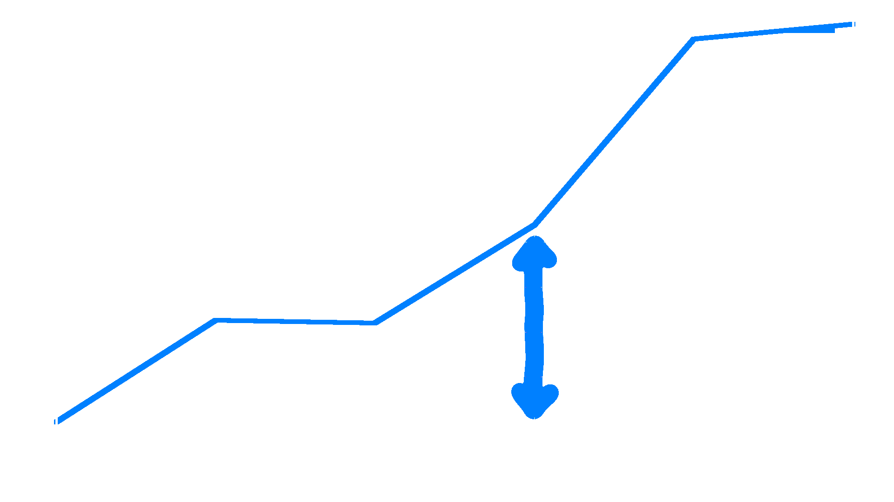

Who am I
---

<!-- pause -->
##### **a passionate software engineer**
<!-- pause -->
##### *things I worked on*
<!-- pause -->
#### telecom switching stations
<!-- pause -->
#### JIT compilers
#### (Mono project, then V8 in Google)
<!-- pause -->
#### gaming engines (Unity 3D)
<!-- pause -->
#### interactive, collaborative VR
<!-- pause -->
##### 🦀 distributed systems and blockchains 🦀
<!-- pause -->
#### 🦀 operational research (vehicle routing) 🦀

-------

This Talk...
---

#### ...actually already happened!
#### TsConf 2019
##### Desenzano
##### I did it with Gianluca Carucci
#### (but it was not recorded)

-------

What Actually happened
---

##### Gianluca:
> Aren't these abstractions amazing?

##### Massi:
> Ok, but how much do they cost?

#### ...and then we started talking...

-------

Abstractions, the Simplistic Way
---

#### using abstractions, we make
##### software easier to understand

##### software has less bugs

##### software is more maintaineble

##### let's use more abstractions...

##### profit!

-------

TL;DR
---

##### It's
##### **Not**
##### *That*
##### **Simple!**

-------

An Example: **Library Order Workflow**
---

#### get an order of books
##### (la list of books and quantities)

#### validate it
##### (using an external service)

#### place the order
##### (compute its price first)


-------

Game Rules
---

##### each operation is async

##### each operation can fail

#### the workflow result is
##### the order total cost

-------

Plain `async` TypeScript
---

```typescript
  const order = await orderService(orderKey)
  if (order == null) {
    return { success: false }
  }

  const validationResult = await validationService(order)
  if (!validationResult.valid) {
    return { success: false }
  }

  return await placeOrderService(order)
```

-------

Abstraction: **Monadic Composition**
---

##### *did you notice those error handling blocks?*

```typescript
  if (/* something wrong */) {
    return { success: false }
  }
```

#### they are **repetitive** and get in the way
##### they are like **noise** hiding the main flow

#### could we just **compose** the *main blocks* and
##### let the *composition* handle the **effects**?

-------

Functional TypeScript (Effects)
---

```typescript
  return Effect.runAync(
    pipe(
      orderKey,
      orderService,
      Effect.andThen(validationService),
      Effect.andThen(placeOrderService),
      Effect.catchAll(e => Effect.succeed({ success: false }))
    )
  )
```

##### *this uses the **Effects** library*

-------

Functional TypeScript (Effects)
---

```typescript {1,2,8,9}
  return Effect.runAync(
    pipe(
      orderKey,
      orderService,
      Effect.andThen(validationService),
      Effect.andThen(placeOrderService),
      Effect.catchAll(e => Effect.succeed({ success: false }))
    )
  )
```

##### *we first build and async pipe*

-------

Functional TypeScript (Effects)
---

```typescript {3}
  return Effect.runAync(
    pipe(
      orderKey,
      orderService,
      Effect.andThen(validationService),
      Effect.andThen(placeOrderService),
      Effect.catchAll(e => Effect.succeed({ success: false }))
    )
  )
```

##### *pass the **order key** as 1st argument*

-------

Functional TypeScript (Effects)
---

```typescript {4-6}
  return Effect.runAync(
    pipe(
      orderKey,
      orderService,
      Effect.andThen(validationService),
      Effect.andThen(placeOrderService),
      Effect.catchAll(e => Effect.succeed({ success: false }))
    )
  )
```

##### *and then run the workflow*

-------

Functional TypeScript (FP-TS)
---

```typescript {2-4}
  return pipe(
    orderService(key),
    chain(validationService),
    chain(placeOrderService)
  )()
    .then(evaluateEither)
    .catch(() => { success: false })
```

#### *an alternative implementation*
##### *using the **FP-TS** library*

-------

Abstraction: **Typestate Pattern**
---

##### consider this error handling logic:

```typescript
  const validationResult = await validationService(order)
  if (!validationResult.valid) {
    return { success: false }
  }
  return await placeOrderService(order)
```

##### isn't this brittle?

-------

Abstraction: **Typestate Pattern**
---

##### what if we didn't validate the order:

```typescript
  const validationResult = await validationService(order)
  // if (!validationResult.valid) {
  //   return { success: false }
  // }
  return await placeOrderService(order)
```

##### when would the error be caught?

-------

Abstraction: **Typestate Pattern**
---

##### if validation generated a validated order...

```typescript
  const order = await validationService(order)
  if (!order.valid) {
    return { success: false }
  }
  return await placeOrderService(order)
```

##### ...and `placeOrderService` required it...

-------

Abstraction: **Typestate Pattern**
---

##### ...then this code...

```typescript
  const order = await validationService(order)
  // if (!order.valid) {
  //   return { success: false }
  // }
  return await placeOrderService(order)
```

##### ...would not even compile!

-------

Checked TypeScript
---

```typescript {2-4}
  return pipe(
    orderService(key),
    chain(validationService),
    chain(placeOrderService)
  )()
    .then(evaluateEither)
    .catch(() => { success: false })
```

##### `validationService` returns a different type
##### `placeOrderService` only accepts that type

-------

Checked TypeScript
---

```typescript {2-4}
  return pipe(
    orderService(key),
    // chain(validationService),
    chain(placeOrderService)
  )()
    .then(evaluateEither)
    .catch(() => { success: false })
```

##### This does not compile!

-------

So Far, So Good
---

##### do abstractions look nice?

##### do they improve the code?

##### do they cost us anything?

#### what does it mean, and
##### how do we know?

##### let's **define** a few *terms*

-------

Definitions
---

> **Abstraction:**
> A **single** *high level* construct that can replace **many** *low level* ones

##### An uncontroversial example:
#### structured programming
#### (no `goto`s)

-------

Definitions
---

> **Maintainability:**
> How **easy** it is to *change* a piece of software **without** introducing *bugs*

##### *correlated* to **clarity**
##### *negated* by **complexity**

-------

Definitions
---

> **Cognitive:**
> related to something you know, from the Latin *cognosco* (I know), in turn from the Greek *gnόsis* (*γνώσις*, knowledge)

> **Overhead:**
> and extra quantity, usually undesired

#### a *cognitive overhead* is
#### something you **must** keep in your mind
#### which you would rather
#### **avoid** having to think about

-------

Software Performance
---

> **Performance:**
> *efficiency* in using **resources** to obtain a given **result**

##### software has a **better** performance if it:
#### uses **less** *CPU time*
#### uses **less** *memory*

-------

Cost
---

> **Cost:**
> something you must *lose* to obtain a given *result*

##### usually **money**
##### but also **time**
##### *(which, as we know, is money)*

-------

Definitions
---

```

 👉 Abstraction
 👉 Maintainability
 👉 Cognitive Overhead
 👉 Performance
 👉 Cost

```

-------

Abstractions Effects
---

```
 ┏━━━━━━━━━━━━━━━━━━━━━━━━━━━━━┓
 ┃      Domain        ┃ Result ┃
 ┃━━━━━━━━━━━━━━━━━━━━┃━━━━━━━━┃
 ┃                    ┃        ┃
 ┃                    ┃        ┃
 ┃                    ┃        ┃
 ┃                    ┃        ┃
 ┗━━━━━━━━━━━━━━━━━━━━━━━━━━━━━┛
```

-------

Abstractions Effects
---

```
 ┏━━━━━━━━━━━━━━━━━━━━━━━━━━━━━┓
 ┃      Domain        ┃ Result ┃
 ┃━━━━━━━━━━━━━━━━━━━━┃━━━━━━━━┃
 ┃ Maintainability    ┃ 😀 ➕➕┃
 ┃                    ┃        ┃
 ┃                    ┃        ┃
 ┃                    ┃        ┃
 ┗━━━━━━━━━━━━━━━━━━━━━━━━━━━━━┛
```

-------

Abstractions Effects
---

```
 ┏━━━━━━━━━━━━━━━━━━━━━━━━━━━━━┓
 ┃      Domain        ┃ Result ┃
 ┃━━━━━━━━━━━━━━━━━━━━┃━━━━━━━━┃
 ┃ Maintainability    ┃ 😀 ➕➕┃
 ┃ Cognitive Overhead ┃ 😐 ➖  ┃
 ┃                    ┃        ┃
 ┃                    ┃        ┃
 ┗━━━━━━━━━━━━━━━━━━━━━━━━━━━━━┛
```

-------

Abstractions Effects
---

```
 ┏━━━━━━━━━━━━━━━━━━━━━━━━━━━━━┓
 ┃      Domain        ┃ Result ┃
 ┃━━━━━━━━━━━━━━━━━━━━┃━━━━━━━━┃
 ┃ Maintainability    ┃ 😀 ➕➕┃
 ┃ Cognitive Overhead ┃ 😐 ➖  ┃
 ┃ Performance        ┃ 🤔     ┃
 ┃                    ┃        ┃
 ┗━━━━━━━━━━━━━━━━━━━━━━━━━━━━━┛
```

-------

Abstractions Effects
---

```
 ┏━━━━━━━━━━━━━━━━━━━━━━━━━━━━━┓
 ┃      Domain        ┃ Result ┃
 ┃━━━━━━━━━━━━━━━━━━━━┃━━━━━━━━┃
 ┃ Maintainability    ┃ 😀 ➕➕┃
 ┃ Cognitive Overhead ┃ 😐 ➖  ┃
 ┃ Performance        ┃ 🤔     ┃
 ┃ Overall Cost       ┃ ❓❓❓ ┃
 ┗━━━━━━━━━━━━━━━━━━━━━━━━━━━━━┛
```

-------

Abstractions Effects
---

```
 ┏━━━━━━━━━━━━━━━━━━━━━━━━━━━━━┓
 ┃      Domain        ┃ Result ┃
 ┃━━━━━━━━━━━━━━━━━━━━┃━━━━━━━━┃
 ┃ Maintainability    ┃ 😀 ➕➕┃
 ┃ Cognitive Overhead ┃ 😐 ➖  ┃
 ┃ Performance        ┃ 🤔     ┃
 ┃ Overall Cost       ┃ ❓❓❓ ┃
 ┗━━━━━━━━━━━━━━━━━━━━━━━━━━━━━┛
```

##### cognitive overhead is tricky...

##### but we can measure performance!

-------

Measuring Performance
---

#### we can **benchmark**
##### the *implementations*

##### record all execution times *(μs)*

##### and **plot** them!

-------

Benchmark Rules
---

#### process 100k orders
##### (with a 20k warmup)

#### inject a %5 failure rate
##### (to test error handling code)

##### take the mean execution time *(μs)*

##### (executed with deno 2.2.3)

-------

Tested Implementations
---

##### plain **async**
##### **Effects** *(functional framework)*
#### **FP-TS** *(2019)*
##### **FP-TS** *(2025)*
#### **FP-TS** with typestate *(2019)*
##### **FP-TS** with typestate *(2025)*

-------

Typescript Abstractions
---


##### is it any fast?

-------

`async` to `Effects` library
---



##### about **3x** *slowdown*

-------

`async` to `FP-TS` library (2019 version)
---


##### about **2x** *slowdown*

-------

`async` to `FP-TS` library (2025 version)
---


##### about **5x** *slowdown*

-------

The Typestate Pattern
---


##### has no impact on performance

-------

Benchmark Summmary
---

##### *abstractions* **do** have a **cost**

##### *does it matter?*

##### in a *front end*, likely **no**

##### in a *back end*, likely **yes**

##### *could they have* **zero cost** *?*

-------

Zero-Cost Abstractions
---

#### there are languages that claim this
##### *(mostly C++, Rust, likely Zig...)*

#### bot **what**
##### does it **mean**?

-------

Zero-Cost Abstractions
---

##### C++ Definition:

> C++ implementations obey the zero-overhead principle:
> What you don't use, you don't pay for. And further:
> What you do use, you couldn't hand code any better.
> 🖋    *Stroustrup, 1994*

##### meaning:

#### the abstractions are just as performant
#### as if you had written the underlying code
#### by hand

-------

An Example: `filter map`
---

#### *Javascript*

```javascript
const evenSquaredNumbers = numbers
    .filter((num) => num % 2 === 0);
    .map((num) => num * num);
```

#### *Rust*

```rust
let even_squared_sumbers = numbers.into_iter()
    .filter(|&num| num % 2 == 0)
    .map(|num| num * num)
    .collect::<Vec<_>>();
```
-------

Does It Matter?
---

##### as usual, *it depends*

##### suppose this is server-side code

##### ❓ would you want to choose between ❓
#### 😃 maintaineble code 😃
#### 🤑 doubling your cloud bills 🤑

-------

Let's Check If This Is True!
---

##### 🦀 Rust mplementation benchmark 🦀

##### fair adaptation of the Typescript code

##### same rules as before

##### (built with Rust 1.85.1)

-------

Idiomatic `async` Rust
---

```rust
let order = order_service(key).await;
let validated = validation_service(order).await?;
let amount = place_order_service(validated).await?.amount;
```

-------

Rust with explicit `Future` code
---

```rust
order_service(key).await
    .ok_or_else(|| OrderNotValid::BookNotExists)
    .map(validation_service).await
    .map(place_order_service).await
    .map(|result| result.amount)
```

-------

Rust with functional composition
---

```rust
compose!
    (&validation_service, &place_order_service)
    (order_service(key))
```

##### *(the code with **typestate pattern** is the same)*

-------

Rust Benchmark Result
---


##### about **1.4x** *slowdown*

-------

Typescript *vs* Rust
---


##### 😮 from **7x** to **27x** *slower* 😮

-------

Typescript *vs* Rust
---

#### why is Typescript
##### so much slower?

#### can we investigate
##### the cause?

##### yes, we can!

-------

Typescript Benchmarks
---

#### plain **synchronous** code
#### *synchronous* code using **callbacks**
#### *synchronous* code using **FP-TS** *(2019)*
##### *synchronous* code using **FP-TS** *(2025)*

#### *asynchronous* code using **callbacks**
##### plain **async** code

#### **Effects** *(functional framework)*
#### **FP-TS** *(2019)*
##### **FP-TS** *(2025)*
#### **FP-TS** with typestate *(2019)*
##### **FP-TS** with typestate *(2025)*


-------

Typescript Benchmarks
---


-------

Typescript Benchmarks
---


-------

Typescript Benchmarks
---


-------

Typescript Benchmarks
---


-------

Rust Benchmarks
---

#### plain **synchronous** code
#### *synchronous* with **functional composition**
#### *synchronous* with **functional composition** and **typestate**
##### *synchronous* with **functional pipeline**

#### *async* **imperative** code
#### *async* **idiomatic** code
##### *async* code using **`Future` API**

#### *async* code using **`Future` Objects**
#### *asynchronous* with **functional composition**
##### *asynchronous* with **functional composition** and **typestate**


-------

Rust Benchmarks
---


-------

Typescript *vs* Rust
---


-------

Was This Fair?
---

#### after all, Rust compiles
##### to native code

##### it cannot run in a browser

##### or can it?

-------

Enter **`WASM`**
---

##### Rust can compile to **WASM**

##### it is like adding an abstraction

#### from native code
##### to code that can run on any CPU

-------

WASM Benchmarks
---


-------

Full Rust Benchmarks
---


-------

Full Benchmark Results
---


-------


-------


-------


-------


-------


-------


-------


-------


-------


-------


-------


-------


-------


-------

😃 That's all folks! 😃
---

<!-- pause -->
##### 🙏 **thanks!** 🙏
<!-- pause -->
##### ❓ *questions?*  ❓


-------


Recap
---

<!-- pause -->
##### 🦀 Rust is amazing 🎇
<!-- pause -->
##### 🛠  there are projects where it shines 🌞
<!-- pause -->
#### 🤝 you build trust 🤝
##### 🔮 by being reliable 🔮
<!-- pause -->
##### 😃 a healthy workplace is important 😃
<!-- pause -->
#### 🙏 **thanks!** 🙏
<!-- pause -->
##### ❓ *questions?*  ❓
